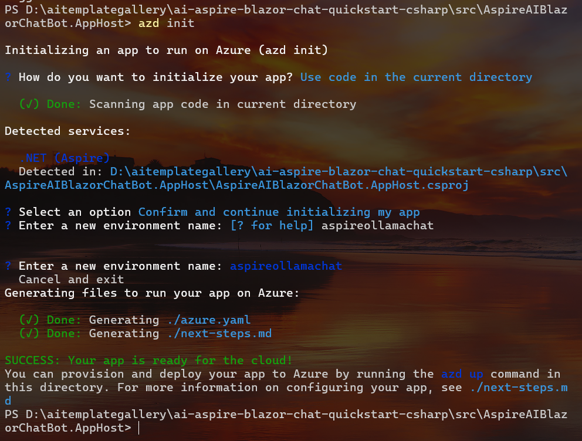
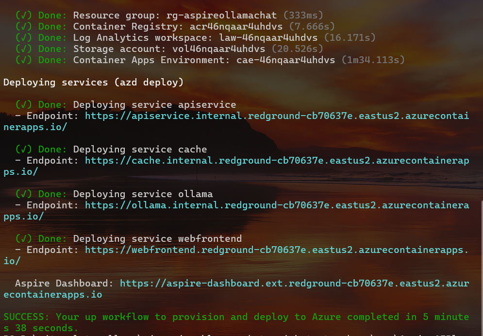
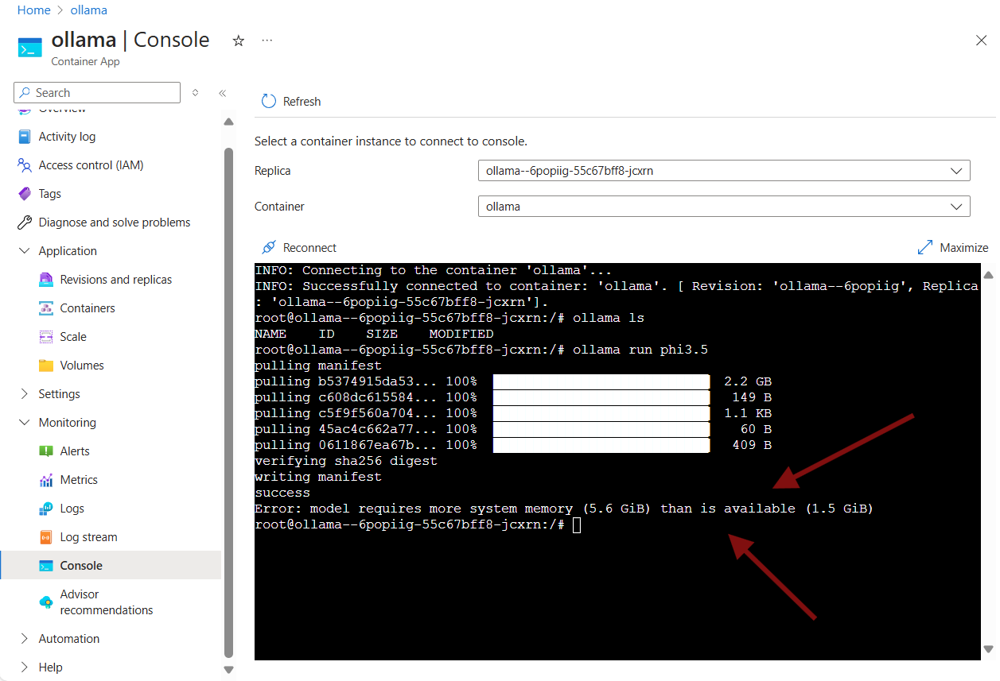
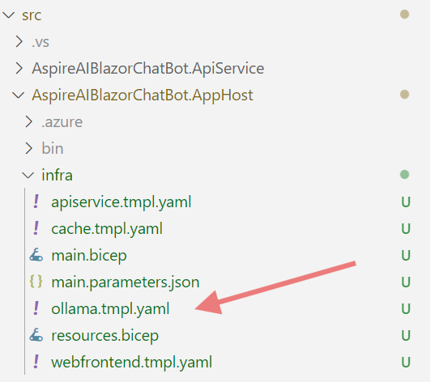
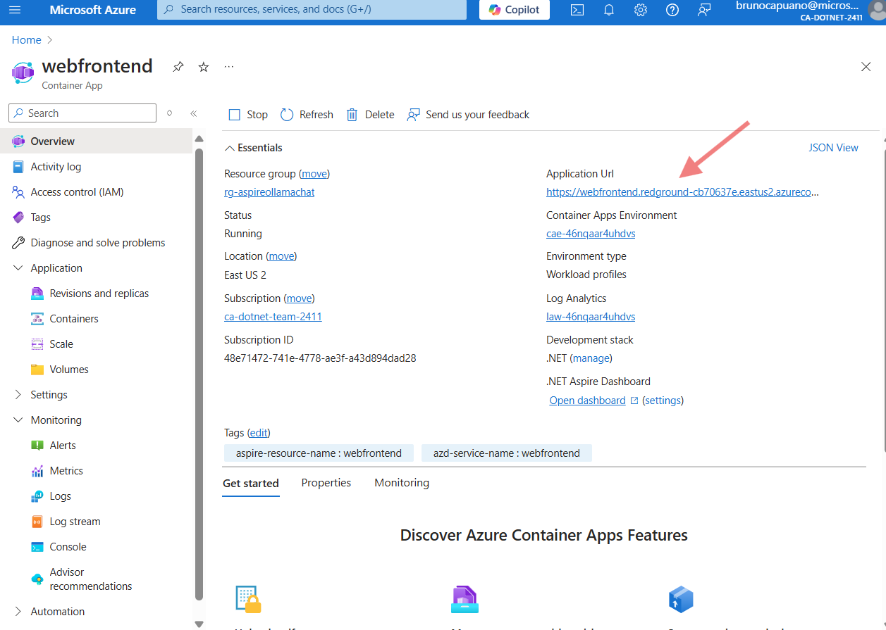
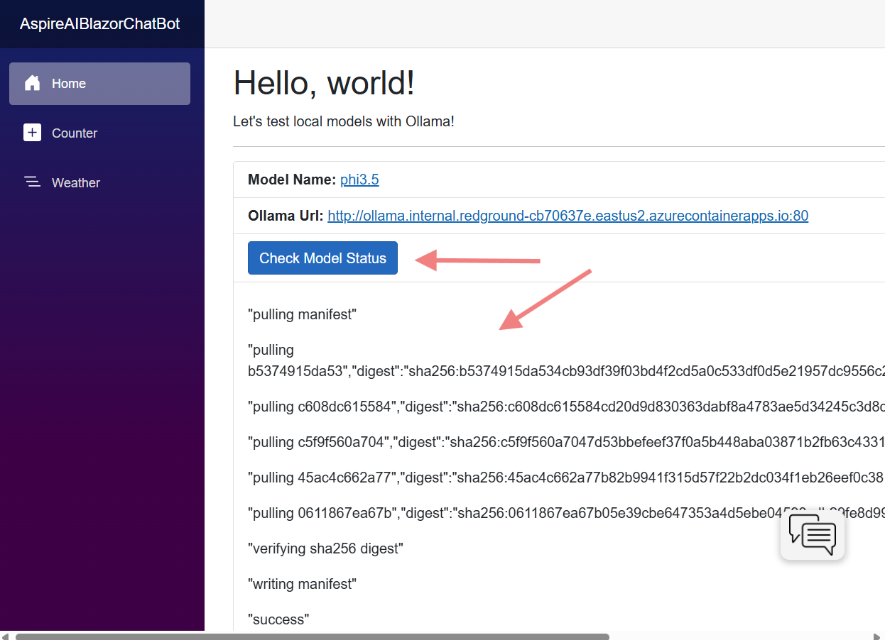
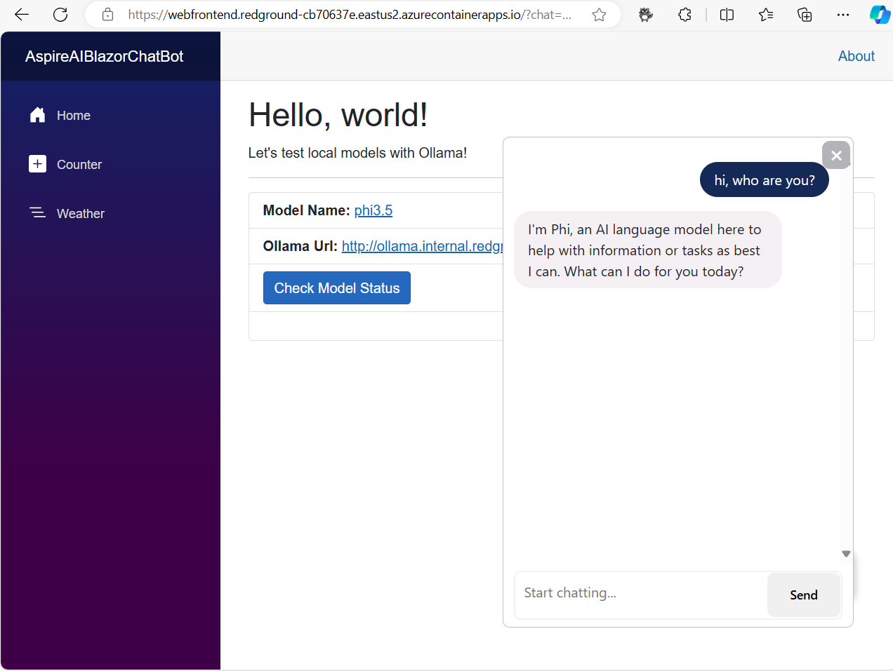

# Chat Application using Aspire and Ollama (C#/.NET)

[](https://codespaces.new/elbruno/ai-aspire-blazor-chat-quickstart-csharp)
[](https://vscode.dev/redirect?url=vscode://ms-vscode-remote.remote-containers/cloneInVolume?url=https://github.com/elbruno/ai-aspire-blazor-chat-quickstart-csharp)

This repository includes a .NET/C# app, created using the .NET Aspire Starter App sample demo, that uses redis.

The repository includes all the infrastructure and configuration needed to provision the solution resources and deploy the app to [Azure Container Apps](https://learn.microsoft.com/azure/container-apps/overview) using the [Azure Developer CLI](https://learn.microsoft.com/azure/developer/azure-developer-cli/overview).

***Note:** The current solution uses [.NET Aspire Community Toolkit Ollama integration](https://learn.microsoft.com/en-us/dotnet/aspire/community-toolkit/ollama?tabs=dotnet-cli%2Cdocker) to include and deploy a Phi-3.5 model without the need to install ollama locally.*

* [Features](#features)
* [Architecture diagram](#architecture-diagram)
* [Getting started](#getting-started)
  * [Local Environment - Visual Studio or VS Code](#local-environment)
  * [GitHub Codespaces](#github-codespaces)
  * [VS Code Dev Containers](#vs-code-dev-containers)
* [Deploying](#deploying)
* [Guidance](#guidance)
  * [Costs](#costs)
  * [Security Guidelines](#security-guidelines)
* [Resources](#resources)

## Features

* A [Blazor Front End](https://dotnet.microsoft.com/en-us/apps/aspnet/web-apps/blazor) that uses [Microsoft.Extensions.AI](https://devblogs.microsoft.com/dotnet/introducing-microsoft-extensions-ai-preview/) package to access language models to generate responses to user messages.
* The Blazor Frontend app included with the .NET Aspire Starter App template, that display a chat panel to interact with the LLM.
* [Bicep files](https://docs.microsoft.com/azure/azure-resource-manager/bicep/) for provisioning the necessary Azure resources, including Azure Container Apps, Azure Container Registry, Azure Log Analytics, and RBAC roles.
* Using the [Phi-3.5](https://aka.ms/Phi-3CookBook) model through [Ollama](https://ollama.com/library) running in a container.


## Architecture diagram

    ** Work In Progress **

## Getting started

You have a few options for getting started with this template.
The quickest way to get started is GitHub Codespaces, since it will setup all the tools for you, but you can also [set it up locally](#local-environment).

### GitHub Codespaces

You can run this template virtually by using GitHub Codespaces. The button will open a web-based VS Code instance in your browser:

1. Open the template (this may take several minutes):

    [](https://codespaces.new/elbruno/ai-aspire-blazor-chat-quickstart-csharp)

2. Open a terminal window
3. Continue with the [deploying steps](#deploying)

### Local Environment

If you're not using one of the above options for opening the project, then you'll need to:

1. Make sure the following tools are installed:

    * [.NET 8](https://dotnet.microsoft.com/downloads/)
    * [Git](https://git-scm.com/downloads)
    * [Azure Developer CLI (azd)](https://aka.ms/install-azd)
    * [VS Code](https://code.visualstudio.com/Download) or [Visual Studio](https://visualstudio.microsoft.com/downloads/)
        * If using VS Code, install the [C# Dev Kit](https://marketplace.visualstudio.com/items?itemName=ms-dotnettools.csdevkit)

2. Fork and Clone the current repository:

3. If you're using Visual Studio, open `the src/AspireAIBlazorChatBot.sln` solution file. If you're using VS Code, open the src folder.

4. Continue with the [deploying steps](#deploying).

### VS Code Dev Containers

A related option is VS Code Dev Containers, which will open the project in your local VS Code using the [Dev Containers extension](https://marketplace.visualstudio.com/items?itemName=ms-vscode-remote.remote-containers):

1. Start Docker Desktop (install it if not already installed)
2. Open the project:

    [](https://vscode.dev/redirect?url=vscode://ms-vscode-remote.remote-containers/cloneInVolume?url=https://github.com/elbruno/ai-aspire-blazor-chat-quickstart-csharp)

3. In the VS Code window that opens, once the project files show up (this may take several minutes), open a terminal window.

4. Continue with the [deploying steps](#deploying)

## Deploying

Once you've opened the project in [Codespaces](#github-codespaces), in [Dev Containers](#vs-code-dev-containers), or [locally](#local-environment), you can deploy it to Azure.

### Azure account setup

1. Sign up for a [free Azure account](https://azure.microsoft.com/free/) and create an Azure Subscription.
2. Check that you have the necessary permissions:

    * Your Azure account must have `Microsoft.Authorization/roleAssignments/write` permissions, such as [Role Based Access Control Administrator](https://learn.microsoft.com/azure/role-based-access-control/built-in-roles#role-based-access-control-administrator-preview), [User Access Administrator](https://learn.microsoft.com/azure/role-based-access-control/built-in-roles#user-access-administrator), or [Owner](https://learn.microsoft.com/azure/role-based-access-control/built-in-roles#owner). If you don't have subscription-level permissions, you must be granted [RBAC](https://learn.microsoft.com/azure/role-based-access-control/built-in-roles#role-based-access-control-administrator-preview) for an existing resource group and deploy to that existing group.
    * Your Azure account also needs `Microsoft.Resources/deployments/write` permissions on the subscription level.

### Deploying with azd

From a Terminal window, open the folder with the clone of this repo. Run the following commands.

1. Navigate to the .NET Aspire AppHost project:

    In Windows:

    ```bash
    cd .\src\AspireAIBlazorChatBot.AppHost\
    ```

    In Mac / Linux:

    ```bash
    cd ./src/AspireAIBlazorChatBot.AppHost/
    ```

1. Login to Azure:

    ```bash
    azd auth login
    ```

1. Init the resources for the Azure Deploy, and select the option to use the code in the current directory and define the name for the new environment. Run the command:

    ```bash
    azd init
    ```

    This image shows an example creating an environment named `aspireollamachat`.

    

    To describe the infrastructure and application, an `azure.yaml` was added with the AppHost directory.

1. Provision and deploy all the resources:

    ```shell
    azd up
    ```

    It will prompt you to select a Subscription from your Azure account, and select a location (like "**East US 2**"). Then it will provision the resources in your account and deploy the latest code. If you get an error or timeout with deployment, changing the location can help.

1. When `azd` has finished deploying, you'll see 5 endpoint URIs:

    * service apiservice
    * service cache
    * service ollama service
    * service webfrontend
    * Aspire Dashboard

    

    The Azure resource group now have the following services deployed:

    

***Important:** The **ollama service** is not ready yet! Follow the next steps to complete the ollama deployment.*

### Update the Ollama Service

The ollama service is ready to be used, however, it does not have any model yet. When connected to the console and try to pull a model, the following error will be displayed.

```shell
Error: model requires more system memory (5.6 GiB) than is available (1.5 GiB)
```


We need to redeploy the ollama service with more system memory assigned. To modify the infrastructure that `azd` uses, run `azd infra synth` to persist it to disk.

1. Run the command to generate the infrastructure files.

    ```bash
    azd infra synth
    ```

1. After running the command some additional directories will be created:

    ```yaml
    - infra/            # Infrastructure as Code (bicep) files
      - main.bicep      # main deployment module
      - resources.bicep # resources shared across your application's services
    ```

    In addition, for each project resource referenced by in the app host, a `containerApp.tmpl.yaml` file will be created in a directory named `manifests` next the project file. Each file contains the infrastructure as code for running the project on Azure Container Apps.

    *Note*: Once you have synthesized your infrastructure to disk, changes made to your App Host will not be reflected in the infrastructure. You can re-generate the infrastructure by running `azd infra synth` again. It will prompt you before overwriting files. You can pass `--force` to force `azd infra synth` to overwrite the files without prompting.

1. Let's edit the the `ollama.tmpl.yaml` file:

    

1. On the ollama container definition, add the necessary resources including `cpu: 3` and `memory: "6.0Gi"`.

    ```yml
    containers:
      - image: {{ .Image }}
        name: ollama
        env:
          - name: AZURE_CLIENT_ID
            value: {{ .Env.MANAGED_IDENTITY_CLIENT_ID }}
        volumeMounts:
          - volumeName: ollama-aspireaiblazorchatbotapphostollamaollama
            mountPath: /root/.ollama
        resources:
          cpu: 3
          memory: "6.0Gi"
    ```

    ***Note:** You can see a sample of the file in `.\infra\sample\ollama.tmpl.yaml`.*

1. When you've made any changes to the ollama infrastructure code, let's redeploy the service:

    ```shell
    azd deploy ollama
    ```

1. Now we can deploy the model from the chat app. Open the chat application from the published url.

    In the azure portal, you can check the url from the published resource.

    

1. In the home page, press the `Check Model Status` button. This will start the model download if the model is not downloaded yet. And show the progress. **This process may take a couple of minutes**.

    Once the model is full downloaded, the home page should display this:

    

1. Now the chat panel should be ready to interact with the user.

    

### Continuous deployment with GitHub Actions

1. Create a workflow pipeline file locally. The following starters are available:

   * [Deploy with GitHub Actions](https://github.com/Azure-Samples/azd-starter-bicep/blob/main/.github/workflows/azure-dev.yml)
   * [Deploy with Azure Pipelines](https://github.com/Azure-Samples/azd-starter-bicep/blob/main/.azdo/pipelines/azure-dev.yml)

2. In the AppHost project folder, run `azd pipeline config -e <environment name>` to configure the deployment pipeline to connect securely to Azure. An environment name is specified here to configure the pipeline with a different environment for isolation purposes. Run `azd env list` and `azd env set` to reselect the default environment after this step.

## Guidance

### Costs

Pricing varies per region and usage, so it isn't possible to predict exact costs for your usage.
The majority of the Azure resources used in this infrastructure are on usage-based pricing tiers.
However, Azure Container Registry has a fixed cost per registry per day.

You can try the [Azure pricing calculator](https://azure.com/e/2176802ea14941e4959eae8ad335aeb5) for the resources:

* Azure Container App: Consumption tier with 0.5 CPU, 1GiB memory/storage. Pricing is based on resource allocation, and each month allows for a certain amount of free usage. [Pricing](https://azure.microsoft.com/pricing/details/container-apps/)
* Azure Container Registry: Basic tier. [Pricing](https://azure.microsoft.com/pricing/details/container-registry/)
* Log analytics: Pay-as-you-go tier. Costs based on data ingested. [Pricing](https://azure.microsoft.com/pricing/details/monitor/)

⚠️ To avoid unnecessary costs, remember to take down your app if it's no longer in use,
either by deleting the resource group in the Portal or running `azd down`.

### Security Guidelines

This template is ready to use [Managed Identity](https://learn.microsoft.com/entra/identity/managed-identities-azure-resources/overview) for authenticating to services like Azure OpenAI service.

Additionally, we have added a [GitHub Action](https://github.com/microsoft/security-devops-action) that scans the infrastructure-as-code files and generates a report containing any detected issues. To ensure continued best practices in your own repository, we recommend that anyone creating solutions based on our templates ensure that the [Github secret scanning](https://docs.github.com/code-security/secret-scanning/about-secret-scanning) setting is enabled.

You may want to consider additional security measures, such as:

* Protecting the Azure Container Apps instance with a [firewall](https://learn.microsoft.com/azure/container-apps/waf-app-gateway) and/or [Virtual Network](https://learn.microsoft.com/azure/container-apps/networking?tabs=workload-profiles-env%2Cazure-cli).

## Resources

* [RAG chat with Azure AI Search + C#/.NET](https://aka.ms/ragchatnet): A more advanced chat app that uses Azure AI Search to ground responses in domain knowledge. Includes user authentication with Microsoft Entra as well as data access controls.
* [Develop .NET Apps with AI Features](https://learn.microsoft.com/en-us/dotnet/ai/get-started/dotnet-ai-overview)
